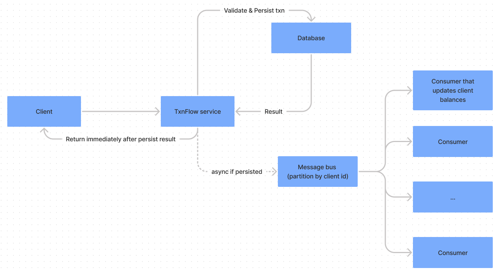

# TxnFlow

## How to review

Review in this order:

1. `main.rs`: Contains the code that runs this system as a binary cli. All it does is get the filename argument and initialize the logger.
1. `lib.rs`: The main meat here is `run_txn_processor`, it initializes the store structs, a csv reader, then enqueuing transaction records to a channel. an
   async process acts as a transaction processor (`runner`)
1. `transactions.rs`: The transaction processor, it "persists" transactions and, if successful, delegates to an account to handle the specific transaction.
1. `account.rs`: Contains the `UserAccount` trait that can update its own state given a transaction.
1. `database.rs`: Contains the `Store` traits (for transactions and users) and an in-memory implementation of them.
1. `tests/integration.rs`: An integration test, very similar to the one in `lib.rs` except it tests the binary and stdout

## Rationale and Design Choices

### Async

This system is not _really_ asynchronous. However, the code pretends to be, in order to illustrate the possible async implementation where implementors of the
async traits make network calls. e.g. I used an async `Channel` to pretend there's a message bus.

### The Store traits

The `TxnStore` and `AccountsStore` traits are technically redundant, but I've added them to show that other implementations of stores could be used, i.e. ones
that are implemented over a network call.

I chose to present them as separate stores because in a real system, the data in these stores is very differently accessed:

* The transaction log is immutable
* Transactions are mostly written, rarely read (only on disputes)
* user accounts might contain other relational data, whereas transactions are a sequential log.

## Optimizations for Production

Transactions need to be processed **in order**, but only for the same customer. i.e. the ordering of 2 transactions for different customers does not matter.

In a prod system, I would imagine a message bus partitioned by `client` where the producers to this message bus would be stateless and parallel, but each
consumer would be processing transactions serially. This will achieve parallel stream computation while preserving the invariant that transaction ordering
matters per client.



As for the Rust code itself, I would change the code in `lib.rs` to take a stream of csv records to deserialize as an argument rather than a file name. Then the
same code could be used as a processor in a server that deserializes a stream of requests.

### Store all transactions

For the purpose of this exercise, I'm only storing the transactions that might need to be fetched later, and I'm modifying the object for ease of use (
specifically making `amount` not optional). A prod system would store a log of all incoming transactions, for auditing and resiliency purposes, because account
states could always be restored by re-running the transactions starting from the last account settlement date.

In this system, stored transactions are mutable in that their `disputed` field is mutable, I just do this in memory for simplicity, it's likely that this part
of the system would be designed differently. I'd keep the original log immutable and persist the `disputed` flag elsewhere.

## Interpretation and assumptions

Going through the various use cases, described, I found inaccuracies and was a bit confused on specifics. It's as if the instructions only consider a user
disputing a `deposit` transaction and not a `withdrawal` transaction. Specifically:

### The instructions:

1. `dispute`: `available -= amount_disputed`; `held += amount_disputed` ("_the clients available funds should decrease by the amount disputed, their held funds
   should increase by the amount disputed_")
1. `resolve`: `available += amount_disputed`; `held -= amount_disputed` ("_the clients held funds should decrease by the amount no longer disputed, their
   available funds should increase by the amount no longer disputed_")
1. `chargeback`: `held -= amount_disputed` ("_the clients held funds and **total** funds should decrease by the amount previously disputed_")
1. `chargeback` represents the client **reversing** a transaction

### Use cases:

The interpretation here is that a `resolve` restores the account to the state it was in prior to the dispute (i.e. reversing the change caused by the `dispute`)
, and that a `chargeback` restores the account to the state it was in prior to the transaction under dispute (i.e. reversing the transaction).

Numbers below are in the format of `available,held`, withdrawal and deposits are of $100.

```
start:     0,0
deposit => 100,0
dispute => 0,100
resolve => 100,0

start:        0,0
deposit    => 100,0
dispute    => 0,100
chargeback => 0,0
```

clearly, when a `deposit` is disputed, following the instructions works and makes sense.

However, when it comes to a `withdrawal`:

--- following instructions -----

```
start:        100,0
withdrawal => 0,0
dispute    => -100,100 : Doesn't make sense
resolve    => 0,0

start:        100,0
withdrawal => 0,0   
dispute    => -100,100 : Doesn't make sense
chargeback => -100,0   : Contradicts (4) and doesn't make sense

```

#### A note on negative numbers

I considered treating the "disputed amount" as a negative number in case of a withdrawal, however, that would result in the held amount potentially being
negative.

My understanding is that a `held` amount means the bank saying "Maybe you have these funds, maybe you don't, for now we're holding onto them." which implies it
would be positive both in case of a deposit or withdrawal.

--- following instructions but the disputed amount is negative -----

```
start:        100,0
withdrawal => 0,0
dispute    => 100,-100 : Doesn't make sense. There should be no available amount because it's under dispute.
...

```

### My interpretation

--- Logical way to handle a withdrawal dispute -----

```
start:        100,0
withdrawal => 0,0
dispute    => 0,100 : Holds the disputed amount to potentially return to the user, but contradicts (1).
resolve    => 0,0   : Releases back the held amount to the withdrawal destination, but contradicts (2).

start:        100,0
withdrawal => 0,0   
dispute    => 0,100 : Holds the disputed amount to potentially return to the user, but contradicts (1).
chargeback => 0,0 : Contradicts (4) in that the transaction is not explicitly reversed, i.e. if we're back to "start", but the client gets their funds back via the chargeback.
```

--------

### Other Assumptions not mentioned in the instructions:

1. The instructions mention "failing" a withdrawal when there are insufficient funds and "ignoring" invalid transaction references. However, they do not mention
   the distinction between failing and ignoring from a code perspective. I hope this passes automated tests but that part was unclear. I chose to always write
   to `stderr` with different log levels.
1. The instructions don't mention how to handle locked accounts. Here, a transaction on a `locked` account is ignored and logged to `stderr`.
1. A transaction can be disputed more than once if it was previously resolved (account is not locked).
1. A dispute on a deposit can result in an account going into negative available balance (I added a test case for this).
1. Transaction ids are unique (as described in the instructions)
1. The system supports deposits & withdrawal of an amount equal to `0`. I figured there might be a case for disputing those as well and then I'd need them
   stored.
1. An account might still get "created" on an invalid transaction and therefore printed. I'd assume that in a prod system, user accounts don't get created by
   sending a transaction.

## Testing & documentation

For simplicity and expediency I wrote a single unit test that covers all cases (verified coverage). Normally I'd write more fine-grained tests in each module as
well.

As for documentation, normally I'd write docstrings with doctests, but again, expediency, and this doc seems exhaustive enough for an exercise :)

### Coverage (buggy)

One time:

```shell
cargo install grcov
rustup install nightly
```

Then:

```shell
./grcov.sh
```

However, this failed locally for me when trying to run `grcov.sh` twice in a row. If I run any other `cargo test` command between `grcov.sh` calls, they work. I
realize grcov runs on nightly with special flags that cause a recompilation, so it seems it works successfully when forcing a recompile. I
thought `CARGO_INCREMENTAL=0` would take care of that.

## Final note

I didn't write any Rust in the last 6 months, and used this opportunity to ... shake off the rust from my **R**ust knowledge. haha.
